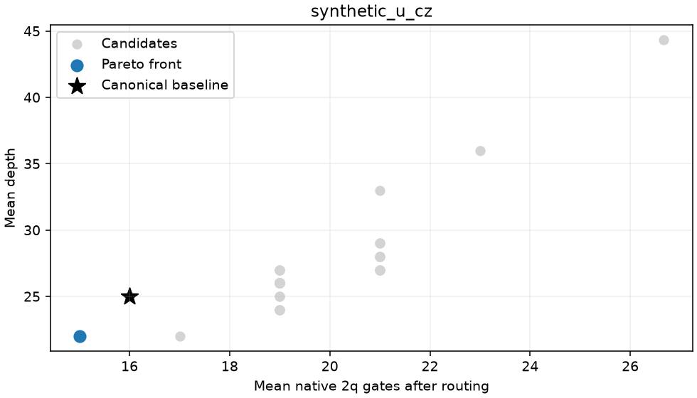

# QuditsOnQubits

**Find cheaper qubit circuits by changing how qutrits are encoded.**

QuditsOnQubits benchmarks encoding bases for qutrit circuits on qubit hardware.
Give it a logical circuit, candidate families and a backend. It synthesizes the
encoded gates, compiles and routes each candidate, checks that the state is
preserved, and returns a Pareto front of circuit costs.

The reference example is a maximally entangled two-qutrit graph state encoded on
four qubits. The same pipeline supports new F3/CZ3 circuits and additional encoding
families. Bell measurement and execution tools are also available.

[Example notebook](notebooks/encoding_benchmark.ipynb) ·
[Benchmark guide](docs/encoding_benchmark.md) ·
[Documentation](docs/README.md) · [Advanced usage](docs/usage_guide.md) · [Roadmap](docs/roadmap.md)

## Install

Python **3.11–3.13**. Clone the repository and create a virtual environment:

```bash
git clone https://github.com/slysek/QuditsOnQubits.git
cd QuditsOnQubits
python -m venv .venv
```

Activate with `source .venv/bin/activate` on Linux/macOS or
`.venv\Scripts\Activate.ps1` in PowerShell, then install:

```bash
python -m pip install --upgrade pip
python -m pip install -e .
```

No provider account is needed for the local examples.
See [installation details](docs/installation.md) for optional integrations.

## Run the example

```bash
python -m jupyterlab notebooks/encoding_benchmark.ipynb
```

Choose **Restart Kernel and Run All Cells**. Five code cells cover configuration,
execution, a baseline comparison and a Pareto plot. The bundled example reuses all
41 saved theta gate sets and performs fresh compilation on a four-qubit line.
It needs no previous results directory and submits no QPU jobs.

Change two settings to run your own search:

```python
families = [LocalSU2(samples=4, seed=42), SchmidtTheta(points=5)]
synthesis = OptimizedSynthesis()
```

The notebook contains the imports and complete `run_benchmark(...)` call.
Fresh optimized synthesis can take substantially longer than replay.
For a quick command-line control using dense exact synthesis:

```bash
qoq-benchmark --backend local --family local-su2 --family schmidt-theta --local-samples 2 --theta-points 3 --synthesis exact --seeds 0 1 2
```

This control uses a different synthesis protocol from the saved theta example;
their Pareto fronts are separate. A complete standalone API example is in
[`examples/two_qutrit_encoding_benchmark.py`](examples/two_qutrit_encoding_benchmark.py).

## What is compared?

| Choice | Meaning |
| --- | --- |
| `LocalSU2` | Local single-qubit basis changes within each two-qubit qutrit encoding. |
| `SchmidtTheta` | A theta sweep of the encoding defined through its leakage state and orthonormal code basis. |
| Backend | Explicit local target, IQM Garnet/Emerald or a named IBM backend. |
| Objectives | Mean native two-qubit gate count, mean depth and depth standard deviation across compiler seeds. |

Costs are measured **after backend-specific compilation and routing**. Every
comparison includes a canonical baseline under the same target and protocol.
Candidates enter the Pareto front only when every planned seed passes gate,
state-fidelity and leakage checks. Saved results include encodings, QPY circuits,
compiler settings, validation metrics and hash-verified provenance.

In the bundled example, a theta candidate gives **15 CZ and depth 22**, compared
with **16 CZ and depth 25** for canonical encoding. This is a local compilation
result for the four-qubit line, Qiskit 2.1.2 and seeds 0, 1, 2, with CZ3 gate
tolerance `5e-4`. It is not a hardware measurement or a global optimum; another
target or compiler version can change the result. See the
[data provenance](examples/data/README.md); run the notebook to reproduce the comparison.



## Scope and next steps

The unified benchmark currently accepts qutrit circuits built from F3 and CZ3,
using one shared encoding per circuit. Validation is intended for small circuits;
the default limit is 12 active qubits. New families and synthesis policies can be
added through the [documented interfaces](docs/encoding_benchmark.md#where-to-extend).

For Bell measurements, start with the separate
[local Aer example](docs/two_qutrit_bell_vertical_slice.md).
[Historical hardware results](benchmarks/bell_20260907/README.md) have their own
offline replay. Research notebooks live under `notebooks/working/`.

Next milestones: broader workloads, backend comparison campaigns and a smaller
optional dependency footprint. See the [roadmap](docs/roadmap.md).

## Contribute and cite

Bug reports, reproducibility checks, new encoding families and backend tests are
welcome. See [CONTRIBUTING.md](CONTRIBUTING.md) and
[open an issue](https://github.com/slysek/QuditsOnQubits/issues).
Citation metadata is in [CITATION.cff](CITATION.cff); include the commit and
benchmark manifest when reporting results.

Licensed under [Apache-2.0](LICENSE).
