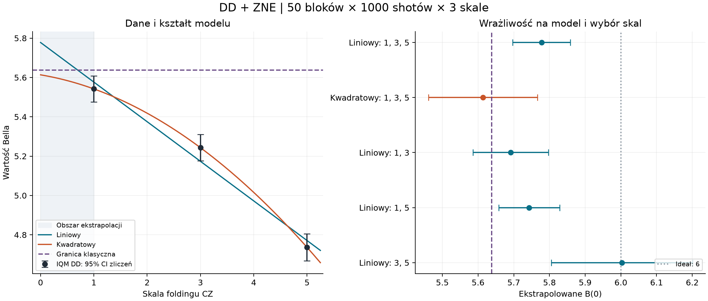

# DD + ZNE: niepewność i błąd modelu

**Wniosek: wynik powyżej granicy klasycznej zależy od modelu. Te dane nie dają stabilnego potwierdzenia naruszenia po ZNE.**

IQM Emerald, DD włączone, twirling wyłączony. Trzy skale CZ: 1, 3, 5; po 50 bloków × 1000 shotów, łącznie 150 000. Granica klasyczna: 5.638155725; idealny obwód: B = 6.

## Niepewność statystyczna

Poniższe ± oznacza jeden błąd standardowy (1σ), a CI to przybliżony, dwustronny przedział 95%. Zakładamy niezależność shotów i bloków, ustalony harmonogram oraz poprawność wybranego modelu. Przedziały nie zawierają błędu modelu ani dowolnego dryfu.

| Estymator | B | SE zliczeń | 95% CI zliczeń |
|---|---:|---:|---|
| Skala 1 | 5.541928 | 0.033973 | [5.475342, 5.608514] |
| Skala 3 | 5.242991 | 0.034387 | [5.175594, 5.310387] |
| Skala 5 | 4.736357 | 0.034952 | [4.667853, 4.804861] |
| linear | 5.777936 | 0.041207 | [5.697172, 5.858701] |
| quadratic | 5.613510 | 0.077955 | [5.460721, 5.766299] |
| linear_1_3 | 5.691396 | 0.053782 | [5.585986, 5.796807] |
| linear_1_5 | 5.743320 | 0.043356 | [5.658344, 5.828297] |
| linear_3_5 | 6.002941 | 0.100692 | [5.805588, 6.200294] |

Dla pierwotnego liniowego ZNE: B(0) = 5.777936 ± 0.041207. Odległość od granicy to 3.39 SE **wyłącznie przy założeniu poprawnego modelu liniowego**.

## Kontrola bootstrapem i zmienność bloków

Wykonano 20000 replik dla każdej metody. Multinomialny bootstrap losuje zliczenia wewnątrz każdego zachowanego bloku. Drugi bootstrap losuje całe bloki osobno w każdej kombinacji ustawienia i skali; zachowuje nierówne liczności ustawień.

| Model | SE bootstrap zliczeń | 95% CI bootstrap zliczeń | SE między blokami | 95% CI Welch między blokami |
|---|---:|---|---:|---|
| linear | 0.041261 | [5.697613, 5.859260] | 0.034634 | [5.706889, 5.848984] |
| quadratic | 0.078336 | [5.460167, 5.767543] | 0.070648 | [5.469295, 5.757725] |

Wariancje zliczeń i bloków to alternatywne oszacowania; nie dodajemy ich. Zmienność bloków bywa mniejsza od wariancji zliczeń wskutek małej próby. To nie dowodzi braku dryfu. Liczności ustawień A0B0…A2B2: [4, 4, 6, 7, 2, 9, 5, 9, 4]. A1B1 ma tylko dwa bloki. Percentylowy bootstrap bloków jest diagnostyczny: jego wariancja jest obciążona w dół przy małych licznościach (dla dwóch bloków o czynnik 1/2). Dlatego główna tabela bloków używa wariancji z korektą n−1 i przybliżenia Welcha.

Przedział Hoeffdinga dla liniowej kombinacji średnich, dopuszczający dowolną zależność shotów wewnątrz bloków, wynosi [1.438828587687567, 10.11704431091609]. Nadal wymaga niezależności bloków, dotyczy ważonej średniej na zmierzonych skalach i nie obejmuje obciążenia ekstrapolacji.

## Dopasowanie i błąd modelu

Kontrast liniowości D = B(1) − 2B(3) + B(5) = -0.207697, SE = 0.084295. Dla modelu liniowego D powinno wynosić zero. Test χ² z 1 stopniem swobody daje p = 0.013742; przy estymacji z bloków test Welcha daje p = 0.021560. Są oznaki odstępstwa od linii prostej przy przyjętych założeniach statystycznych. Wysokie R² samo nie waliduje modelu ([NIST](https://www.itl.nist.gov/div898/handbook/pmd/section4/pmd44.htm)).

Kwadratowe ZNE daje 5.613510, czyli -0.024646 względem granicy. Różnica liniowy − kwadratowy wynosi 0.164426; przewaga liniowego nad granicą wynosi tylko 0.139781. Ta różnica modeli jest miarą wrażliwości, **nie oszacowanym prawdziwym błędem systematycznym ani gwarantowaną granicą tego błędu**.

Model kwadratowy ma trzy parametry i trzy punkty: interpoluje je dokładnie, pozostawiając zero stopni swobody do walidacji. Nie uznajemy go automatycznie za poprawny. Dopisanie c(λ−1)(λ−3)(λ−5) zachowuje wszystkie zmierzone punkty, lecz zmienia B(0) o −15c. Bez dodatkowych założeń o kształcie funkcji nie ma identyfikowalnego błędu samej ekstrapolacji. Taki przykład dotyczy braku ograniczenia narzuconego przez trzy punkty; fizyczne ograniczenia Bella nadal obowiązują.

Względem znanego ideału B=6 liniowe ZNE ma błąd -0.222064 (3.701%), a kwadratowe -0.386490 (6.441%). To całkowity pozostały błąd estymacji; nie da się go z tych danych rozdzielić na błędny kształt ZNE, dryf i nieskalowane błędy sprzętu.

Skale zrealizowano w trzech kolejnych zadaniach. Wspólne identyfikatory bloków nie oznaczają jednoczesnych pomiarów: skala jest splątana z czasem wykonania. Dodatkowo folding zwielokrotnił CZ, pozostawiając liczbę bramek R i pomiarów bez zmian. Ekstrapolacja do λ=0 nie musi usuwać tych pozostałych błędów. Rozdzielenie skalowania szumu i wyboru ekstrapolatora jest podstawą metody ([Giurgica-Tiron i in.](https://arxiv.org/abs/2005.10921)).

## Metoda i odtwarzalność

Dla ustawienia j z n_j blokami obliczamy średnią z jego bloków, następnie sumujemy dziewięć średnich. W każdym bloku wynik to m_sb = Σ_k w_jk p_sbk. Waga stanów poza podprzestrzenią qutritu wynosi zero, ale ich zliczenia pozostają w mianowniku; nie ma postselekcji ani korekcji odczytu.

Var(m_sb) = [Σ_k w_jk² p_sbk − m_sb²]/(N_sb−1). Var(B_s) = Σ_b Var(m_sb)/n_j(b)². Cały rzeczywisty wynik danego bitstringu jest liczony jedną wagą, więc nie pomijamy kowariancji algebraicznych składników Bella. Dla modelu liniowego wagi skal to [13/12, 1/3, −5/12]; dla kwadratowego [15/8, −5/4, 3/8]. Nie zastępujemy pierwotnej regresji nieważonej regresją ważoną.

Wariancja z bloków: Σ_j s²_j/n_j, gdzie s²_j jest wariancją wyników bloków dla danego ustawienia i skali. Dla kontrastów propagujemy niezależne skale, a stopnie swobody przybliżamy wzorem Welcha–Satterthwaite’a. Test liniowości opiera się bezpośrednio na kontraście D i wariancji zliczeń; odpowiada testowi reszt ważonego dopasowania liniowego.

Zweryfikowano SHA256 zapisanych danych sprzętowych i wejściowych, odtworzono trzy wartości Bella oraz pierwotne liniowe ZNE. analysis.json zawiera hashe wejść i skryptu, założenia oraz pełne wyniki. bootstrap.npz zawiera repliki. Przedziały są indywidualne 95%; dobór alternatywnych modeli jest analizą eksploracyjną, nie wcześniej ustaloną procedurą potwierdzania naruszenia.

Kolejny pomiar, jeśli będzie potrzebny: więcej skal blisko 1, przeplatane skale, więcej niezależnych bloków i niezależna walidacja modelu. W tej analizie nie uruchamiano nowych zadań IQM.



## Odtworzenie analizy

Seed bootstrapu: 20260914. Polecenie uruchomione z katalogu projektu:

```powershell
& artifacts/piastq-validation-env/Scripts/python.exe -m scripts.iqm_bell_randomized_uncertainty --run artifacts/bell_optimized/iqm_emerald_dd_zne_50x1000_20260914 --source artifacts/bell_optimized/iqm_emerald_randomized_50x1000_20260914 --output artifacts/bell_optimized/iqm_emerald_dd_zne_50x1000_20260914/uncertainty --draws 20000 --seed 20260914
```

Walidacja: 15 testów zaliczonych, pokrycie nowego modułu 85%, niezależny przegląd CLEAN. Dodatkowo test χ² odtworzony oddzielnie jako suma ważonych reszt regresji; zweryfikowano 37 hashy pochodzenia. Jawne założenie modelu multinomialnego: shoty wewnątrz bloku są niezależne i mają wspólny rozkład. Nie zakładamy, że trzy kolejne zadania sprzętowe są odporne na dryf.
