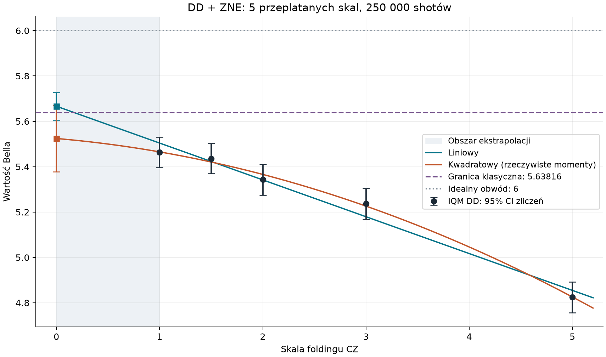

# IQM: DD + ZNE z pięcioma przeplatanymi skalami

Skale: **1, 1.5, 2, 3, 5**. DD: STANDARD_DD_STRATEGY IQM. Twirling i korekcja odczytu wyłączone. Zachowany harmonogram 50 losowań; 1000 shotów na losowanie i skalę. Łącznie **250 000 shotów**.

## Wyniki

**Wynik: liniowe ZNE daje 5.666470 ± 0.031158 (1σ), ale przedział 95% [5.605402, 5.727539] obejmuje granicę klasyczną 5.638156. Nie uzyskano statystycznego potwierdzenia naruszenia w tym wykonaniu.** Test liniowości sumy Bella daje p = 0.166345; nie odrzuca prostej na poziomie 0.05, co nie dowodzi poprawności ekstrapolacji.

Granica klasyczna: **5.638155725**. Ideał: **6**. Niepewności są warunkowe względem przyjętego modelu i założeń o niezależnych zliczeniach.

| Skala | Bell | SE (1σ) | 95% CI |
|---|---:|---:|---|
| 1 | 5.463578 | 0.034167 | [5.396612, 5.530544] |
| 1.5 | 5.435957 | 0.034015 | [5.369289, 5.502626] |
| 2 | 5.342571 | 0.034325 | [5.275296, 5.409847] |
| 3 | 5.236598 | 0.034403 | [5.169169, 5.304027] |
| 5 | 4.824349 | 0.034857 | [4.756030, 4.892668] |

| Model | B(0) | SE (1σ) | 95% CI | Różnica od granicy |
|---|---:|---:|---|---:|
| linear | 5.666470 | 0.031158 | [5.605402, 5.727539] | +0.028315 |
| quadratic_actual_moments | 5.524285 | 0.074931 | [5.377424, 5.671146] | -0.113871 |

Test liniowości sumy Bella: χ² = 5.075587829887441, df = 3, **p = 0.16634517175726762**. To test zgodności danych z prostą, nie prawdopodobieństwo prawdziwości modelu ani test samego naruszenia Bella.

Różnica ekstrapolacji liniowej i kwadratowej: **+0.142186**. Jest to wrażliwość na model, nie oszacowany prawdziwy błąd systematyczny.

Dodatkowy test kwadratowego modelu wszystkich dziewięciu odpowiedzi ustawień: χ² = 45.848006802169415, df = 18 (po 2 na ustawienie), p = 0.00031220080535217064. To silniejsze założenie niż test samej sumy Bella; tych p nie należy bezpośrednio porównywać jako rankingu modeli.

## Przeplatanie i częściowy folding

Każde z 10 zadań zawiera pięć kolejnych losowań i wszystkie pięć skal. Dla każdego losowania i skali przygotowano cztery warianty po 250 shotów, następnie kolejność 100 obwodów w zadaniu przetasowano. Nie wykonywano wszystkich pomiarów jednej skali w osobnym zadaniu. To ogranicza powiązanie skali z czasem, ale nie usuwa dowolnego dryfu.

Każda oryginalna bramka CZ ma dokładnie zadaną średnią liczbę powtórzeń w czterech wariantach. Dodawane są pary CZ·CZ, bez zmiany bramek R i mapowania pomiarów. Przykład przy 5 CZ i skali 1.5: warianty mają skale 1.4, 1.4, 1.4, 1.8 (w permutowanej kolejności). Zapisujemy każdą rzeczywistą skalę. Idealne prawdopodobieństwa wszystkich transformacji sprawdzono lokalnie.

Dla kwadratowej odpowiedzi średnia z wariantów zależy od średniej λ², a nie tylko od (średniej λ)². Dlatego dopasowujemy odpowiedzi ustawień z macierzą [1, E(λ), E(λ²)] i sumujemy ich wyrazy wolne. Model liniowy pozostaje pierwotną nieważoną regresją pięciu wartości Bella. Krzywa kwadratowa na wykresie przedstawia odpowiedź modelu dla jednej dokładnej skali; punkty ułamkowe są mieszaninami wariantów.

## Niepewność i ograniczenia

Bootstrap: 20000 replik, seed 20260915. Losowanie multinomialne osobno dla każdego fizycznego wariantu. Wariancję liczymy przed agregacją, nie traktujemy czterech różnych obwodów jako jednej próby o wspólnym rozkładzie.

Estymator: średnia czterech wariantów, średnia bloków danego ustawienia, suma dziewięciu ustawień. Zdarzenia poza podprzestrzenią qutritu mają wagę zero, ale pozostają w mianowniku. Nie ma postselekcji. Liczności ustawień: [4, 4, 6, 7, 2, 9, 5, 9, 4].

Dodatkowe przedziały z parowanych bloków zachowują korelacje między skalami danego losowania. Zakładają niezależne bloki, więc nie obejmują dryfu wspólnego dla całego zadania. Przy dwóch blokach w jednym ustawieniu bootstrap bloków jest diagnostyczny i może zaniżać wariancję. Pełne liczby i założenia znajdują się w analysis.json.

Folding CZ skaluje tylko część błędów. Liczby bramek R i pomiarów pozostają stałe, a liczba CZ jest jedynie przybliżeniem poziomu szumu. Przedział statystyczny nie obejmuje błędu ekstrapolacji. Powyższe wartości same nie stanowią testu Bella zamykającego luki eksperymentalne.

## Porównanie z poprzednim benchmarkiem

Poprzednie liniowe ZNE (1,3,5, skale wykonywane seriami): 5.777936; nowe: 5.666470; różnica: -0.111466. To osobne wykonania sprzętowe i inny plan próbkowania; różnica nie izoluje efektu samego przeplatania.



## Odtwarzanie i kontrola

Wszystkie 10 zadań ukończono. Kalibracja: 86eefe25-9e43-4376-ad98-39b63cc0ebbc; qubity logiczne: QB28, QB29, QB20, QB21. Dla każdego z pięciu punktów istniejący dekoder Bella odtworzył wynik z dokładnością lepszą niż 2e-15. Sprawdzono unikalność dziesięciu identyfikatorów zadań, 250000 zliczeń oraz hashe danych i kodu po niezależnym przeglądzie.

Walidacja: 12 przypadków testowych zaliczonych, pokrycie nowych modułów 90%, niezależny przegląd CLEAN. Lokalny test przed sprzętem jest osobno oznaczony jako symulacja i nie wchodzi do wyników IQM.

Ponowna analiza zapisanych danych bez wysyłania nowych zadań:

```powershell
& artifacts/piastq-validation-env/Scripts/python.exe -m scripts.iqm_bell_interleaved_zne analyze
```
