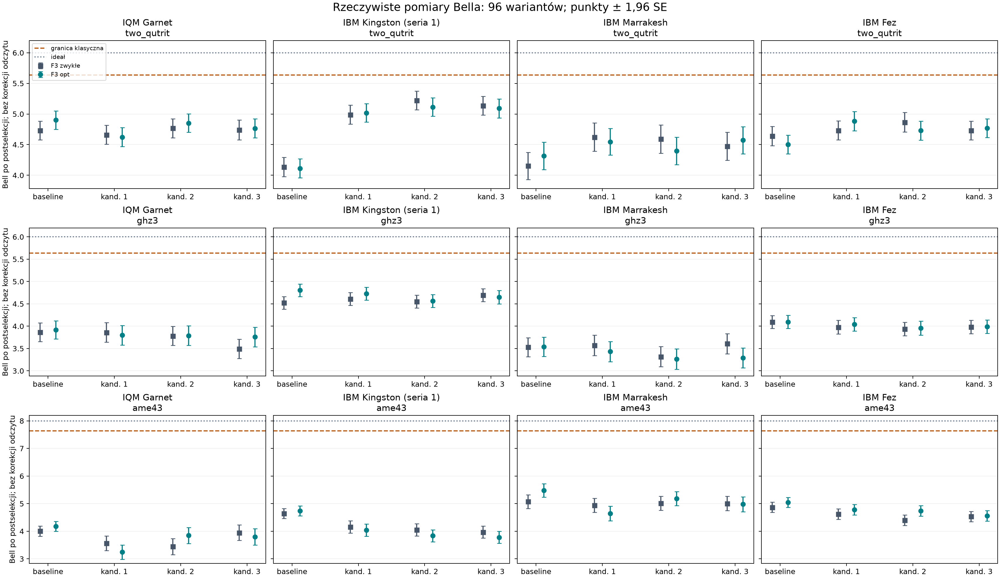
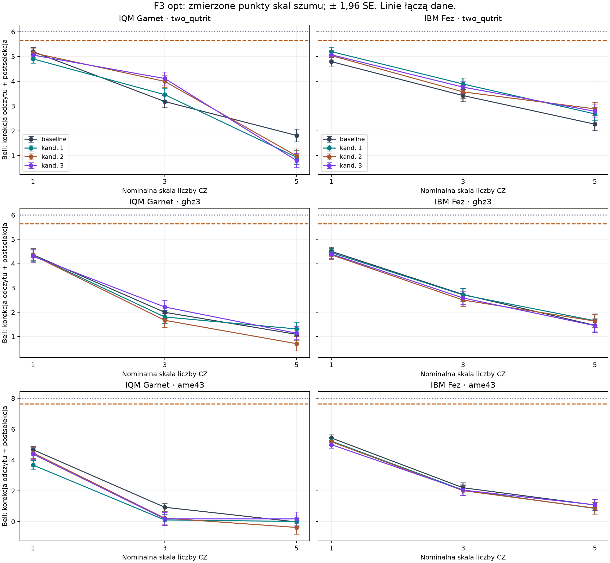

# Analiza repo i benchmark kodowań monomialnych — raport końcowy

**Pomiary rzeczywiste:** IQM Garnet oraz IBM Kingston, Marrakesh i Fez. Ukończono 96 podstawowych wariantów: 3 stany × 4 bazy × 2 F3 × 4 procesory. Dodatkowo wykonano pełne skale CZ 1/3/5 na IQM i Fez. Wszystkie wyniki, również pogorszenia, są zachowane.

**Budżet:** IBM 311/540 s QPU (5 min 11 s); IQM konserwatywne ograniczenie czasu 218,937842/1000 s, odpowiadające 109,468921 kredytu przy podanej stawce 1 kredyt / 2 s. Wartość IQM pochodzi z timeline, nie z faktury. Żadne zadanie nie pozostaje w kolejce ani w wykonaniu.

**Wniosek:** optymalizacja F3 obniża koszt idealnej syntezy, ale nie zapewnia wzrostu Bella w każdym kodowaniu. Wpływ urządzenia i mapowania jest duży. Surowe wyniki pozostają poniżej nominalnych granic klasycznych; najwyższa liczba z ZNE IQM pochodzi z serii odrzucającej model liniowy.

## Najwyższe zmierzone wartości podstawowe

Estymator główny: Bell po odrzuceniu wyników poza kodem, bez korekcji odczytu i bez ZNE. ± oznacza 1 bootstrap SE. Wybór maksimum jest eksploracyjny; przedziały nie mają korekty wielokrotnych porównań.

| Dostawca | Stan | Procesor | Baza | F3 | Bell | Granica klasyczna |
|---|---|---|---|---|---:|---:|
| IQM | two_qutrit | IQM Garnet | canonical_ez | optimal | 4.9010 ± 0.0771 | 5.6381557 |
| IQM | ghz3 | IQM Garnet | canonical_ez | optimal | 3.9144 ± 0.1032 | 5.6381557 |
| IQM | ame43 | IQM Garnet | canonical_ez | optimal | 4.1773 ± 0.0936 | 7.6381557 |
| IBM | two_qutrit | IBM Kingston, seria 1 | sup023_P021_ph012 | standard | 5.2204 ± 0.0778 | 5.6381557 |
| IBM | ghz3 | IBM Kingston, seria 1 | canonical_ez | optimal | 4.8032 ± 0.0723 | 5.6381557 |
| IBM | ame43 | IBM Marrakesh | canonical_ez | optimal | 5.4779 ± 0.1228 | 7.6381557 |

## Trzy wybrane kandydatury dla każdego stanu

Przeszukano pełną dyskretną klasę repo: 4 podpory × 6 permutacji × 27 zestawów faz = 648 baz, czyli 216 przedstawicieli po usunięciu globalnej fazy. Canonical stanowi oddzielny baseline. Na pierwotnych targetach Kingston i IQM wykonano po 651 kompilacji: (216 + baseline) × 3 stany. Ranking minimalizuje średni po dostawcach stosunek kalibracyjnego kosztu błędu do baseline. Koszt to średnia po ustawieniach sumy −log(1−error) bramek i odczytu. Zasady obsługi brakujących kalibracji zapisano przy wynikach przeszukania.

Te trzy bazy są najlepsze według tego zdefiniowanego modelu i przeszukania. Nie udowodniono globalnego optimum rzeczywistego Bella ani optimum ciągłych faz. Selekcję zamrożono przed pierwszymi pomiarami. Na Marrakesh i Fez sprawdzono te same bazy; nie wykonywano nowego pełnego rankingu pod ich szum.

Macierz E ma kolumny E[:,j] = ω^k_j |p_j⟩, gdzie ω = exp(2πi/3), j=0,1,2. Indeksy fizyczne 0,1,2,3 oznaczają 00,01,10,11. Baseline: p=(0,1,2), k=(0,0,0). Pełne macierze: [coding_bases.json](coding_bases.json).

| Stan | Kandydat | Nazwa | p dla logicznych 0,1,2 | k dla logicznych 0,1,2 | φ opt / π |
|---|---:|---|---|---|---:|
| two_qutrit | 1 | sup023_P021_ph000 | (0, 3, 2) | (0, 0, 0) | 0.500000 |
| two_qutrit | 2 | sup023_P021_ph012 | (0, 3, 2) | (0, 2, 1) | 0.500000 |
| two_qutrit | 3 | sup023_P021_ph020 | (0, 3, 2) | (0, 0, 2) | 0.500000 |
| ghz3 | 1 | sup023_P021_ph001 | (0, 3, 2) | (0, 1, 0) | 0.500000 |
| ghz3 | 2 | sup023_P021_ph011 | (0, 3, 2) | (0, 1, 1) | 0.500000 |
| ghz3 | 3 | sup023_P021_ph021 | (0, 3, 2) | (0, 1, 2) | 0.500000 |
| ame43 | 1 | sup012_P210_ph002 | (2, 1, 0) | (2, 0, 0) | 0.500000 |
| ame43 | 2 | sup023_P021_ph000 | (0, 3, 2) | (0, 0, 0) | 0.500000 |
| ame43 | 3 | sup023_P021_ph011 | (0, 3, 2) | (0, 1, 1) | 0.500000 |

## F3 i protokół porównania

Dla E†E=I₃ użyto Uφ = E F₃ E† + exp(iφ)(I₄−EE†), z F₃[j,k]=ω^(jk)/√3. Zwykłe F3: φ=0. Optymalne dopełnienie z repo: φ=π/2 albo 11π/6, zależnie od bazy. Ponieważ UφE=EF₃, idealne działanie na kodzie jest identyczne. Idealna zmiana Bella wynosi zero, a wartości referencyjne to 6, 6 i 8. Pojedyncze F3 redukuje typowo 3 CZ do 2 CZ. Koszt całego eksperymentu może zmieniać się inaczej wskutek routingu i resyntezy.

Oba ramiona mają tę samą konsolidację ważonych krawędzi grafu (CZ² zamiast dwóch CZ w AME), ten sam budżet trzech ziaren kompilacji 907–909 i tę samą funkcję wyboru obwodu. Pełne rozkłady każdego końcowego QPY zweryfikowano dokładnie względem wejścia; ustawienia Bella: 9 dla dwóch qutrytów, 12 dla GHZ, 13 dla AME. Qutryty przypisano do bloków dwóch kubitów od najbardziej znaczącego bloku, zgodnie z przygotowaniem stanów repo. GHZ oznacza referencyjny stan grafowy lokalnie równoważny GHZ trzech qutrytów.

Kingston i Fez: 1024 shoty na ustawienie w pomiarze podstawowym; Marrakesh: 512. IQM: dwa qutryty 1024, GHZ 512, AME kandydaci 512, baseline AME dwa powtórzenia po 512. ZNE IQM i Fez: 512 na ustawienie; baseline AME IQM jest powtórzony w obu partycjach. Pilot IQM (128) nie uczestniczy w rankingu. IBM stosuje DD XY4 i twirling bramek oraz pomiarów, 16 randomizacji. Kolejność obwodów jest losowana deterministycznie.

AME IQM podzielono na partie, ponieważ 104 obwody Bella + 2 kalibracyjne przekraczają limit 100 obwodów joba. Odrzucony pierwszy job nie wykonał instrumentów. Poprawne partie zawierają komplet 13 ustawień dla każdej bazy; powtórzony baseline agregowano wagami liczby shotów.

## Pełne wyniki i różnice względem baseline

Poniższe tabele używają głównego estymatora po postselekcji, bez korekcji odczytu. ΔF3 = opt − standard. Δbase std = kandydat standard − baseline standard; Δbase opt = kandydat opt − baseline opt. Wszystkie różnice dotyczą tego samego urządzenia i etapu. Dodatni znak oznacza poprawę; ujemny pogorszenie. [624 różnice wraz z procentami i 95% CI](all_differences.csv).

### two_qutrit

Ideał 6.0; granica klasyczna 5.6381557247.

**IQM Garnet**

| Baza | Bell F3 zwykłe | Bell F3 opt | ΔF3 | Δbase std | Δbase opt |
|---|---:|---:|---:|---:|---:|
| canonical_ez | 4.7302 ± 0.0782 | 4.9010 ± 0.0771 | +0.1707 ± 0.1090 | — | — |
| sup023_P021_ph000 | 4.6612 ± 0.0785 | 4.6224 ± 0.0791 | -0.0388 ± 0.1108 | -0.0690 ± 0.1113 | -0.2785 ± 0.1104 |
| sup023_P021_ph012 | 4.7681 ± 0.0789 | 4.8504 ± 0.0767 | +0.0823 ± 0.1079 | +0.0378 ± 0.1106 | -0.0506 ± 0.1092 |
| sup023_P021_ph020 | 4.7401 ± 0.0824 | 4.7664 ± 0.0789 | +0.0263 ± 0.1111 | +0.0098 ± 0.1157 | -0.1346 ± 0.1098 |

**IBM Kingston, seria 1**

| Baza | Bell F3 zwykłe | Bell F3 opt | ΔF3 | Δbase std | Δbase opt |
|---|---:|---:|---:|---:|---:|
| canonical_ez | 4.1334 ± 0.0804 | 4.1128 ± 0.0794 | -0.0206 ± 0.1130 | — | — |
| sup023_P021_ph000 | 4.9899 ± 0.0792 | 5.0177 ± 0.0766 | +0.0277 ± 0.1075 | +0.8566 ± 0.1145 | +0.9049 ± 0.1138 |
| sup023_P021_ph012 | 5.2204 ± 0.0778 | 5.1141 ± 0.0764 | -0.1063 ± 0.1072 | +1.0870 ± 0.1127 | +1.0013 ± 0.1074 |
| sup023_P021_ph020 | 5.1357 ± 0.0781 | 5.0911 ± 0.0788 | -0.0446 ± 0.1117 | +1.0023 ± 0.1109 | +0.9783 ± 0.1106 |

**IBM Marrakesh**

| Baza | Bell F3 zwykłe | Bell F3 opt | ΔF3 | Δbase std | Δbase opt |
|---|---:|---:|---:|---:|---:|
| canonical_ez | 4.1539 ± 0.1132 | 4.3156 ± 0.1143 | +0.1617 ± 0.1604 | — | — |
| sup023_P021_ph000 | 4.6230 ± 0.1174 | 4.5469 ± 0.1114 | -0.0761 ± 0.1588 | +0.4690 ± 0.1652 | +0.2313 ± 0.1581 |
| sup023_P021_ph012 | 4.5908 ± 0.1172 | 4.3973 ± 0.1148 | -0.1934 ± 0.1668 | +0.4368 ± 0.1638 | +0.0817 ± 0.1614 |
| sup023_P021_ph020 | 4.4747 ± 0.1163 | 4.5713 ± 0.1129 | +0.0966 ± 0.1607 | +0.3207 ± 0.1647 | +0.2557 ± 0.1624 |

**IBM Fez**

| Baza | Bell F3 zwykłe | Bell F3 opt | ΔF3 | Δbase std | Δbase opt |
|---|---:|---:|---:|---:|---:|
| canonical_ez | 4.6401 ± 0.0801 | 4.5030 ± 0.0779 | -0.1371 ± 0.1107 | — | — |
| sup023_P021_ph000 | 4.7319 ± 0.0788 | 4.8832 ± 0.0807 | +0.1513 ± 0.1127 | +0.0918 ± 0.1125 | +0.3802 ± 0.1108 |
| sup023_P021_ph012 | 4.8655 ± 0.0809 | 4.7293 ± 0.0797 | -0.1362 ± 0.1147 | +0.2253 ± 0.1145 | +0.2263 ± 0.1113 |
| sup023_P021_ph020 | 4.7319 ± 0.0773 | 4.7682 ± 0.0777 | +0.0362 ± 0.1096 | +0.0918 ± 0.1141 | +0.2651 ± 0.1112 |

### ghz3

Ideał 6.0; granica klasyczna 5.6381557247.

**IQM Garnet**

| Baza | Bell F3 zwykłe | Bell F3 opt | ΔF3 | Δbase std | Δbase opt |
|---|---:|---:|---:|---:|---:|
| canonical_ez | 3.8663 ± 0.1064 | 3.9144 ± 0.1032 | +0.0481 ± 0.1447 | — | — |
| sup023_P021_ph001 | 3.8601 ± 0.1118 | 3.7979 ± 0.1111 | -0.0622 ± 0.1572 | -0.0062 ± 0.1573 | -0.1166 ± 0.1477 |
| sup023_P021_ph011 | 3.7817 ± 0.1087 | 3.7888 ± 0.1125 | +0.0071 ± 0.1548 | -0.0845 ± 0.1522 | -0.1256 ± 0.1493 |
| sup023_P021_ph021 | 3.4915 ± 0.1108 | 3.7588 ± 0.1119 | +0.2674 ± 0.1577 | -0.3748 ± 0.1526 | -0.1556 ± 0.1540 |

**IBM Kingston, seria 1**

| Baza | Bell F3 zwykłe | Bell F3 opt | ΔF3 | Δbase std | Δbase opt |
|---|---:|---:|---:|---:|---:|
| canonical_ez | 4.5239 ± 0.0718 | 4.8032 ± 0.0723 | +0.2793 ± 0.1031 | — | — |
| sup023_P021_ph001 | 4.6107 ± 0.0729 | 4.7284 ± 0.0737 | +0.1178 ± 0.1044 | +0.0867 ± 0.1032 | -0.0748 ± 0.1043 |
| sup023_P021_ph011 | 4.5539 ± 0.0731 | 4.5669 ± 0.0733 | +0.0130 ± 0.1032 | +0.0299 ± 0.1042 | -0.2363 ± 0.1044 |
| sup023_P021_ph021 | 4.6955 ± 0.0721 | 4.6477 ± 0.0763 | -0.0478 ± 0.1038 | +0.1715 ± 0.1024 | -0.1555 ± 0.1030 |

**IBM Marrakesh**

| Baza | Bell F3 zwykłe | Bell F3 opt | ΔF3 | Δbase std | Δbase opt |
|---|---:|---:|---:|---:|---:|
| canonical_ez | 3.5286 ± 0.1096 | 3.5369 ± 0.1098 | +0.0083 ± 0.1537 | — | — |
| sup023_P021_ph001 | 3.5700 ± 0.1164 | 3.4306 ± 0.1158 | -0.1394 ± 0.1629 | +0.0415 ± 0.1624 | -0.1062 ± 0.1593 |
| sup023_P021_ph011 | 3.3187 ± 0.1161 | 3.2633 ± 0.1172 | -0.0554 ± 0.1662 | -0.2098 ± 0.1601 | -0.2735 ± 0.1598 |
| sup023_P021_ph021 | 3.6072 ± 0.1138 | 3.2872 ± 0.1134 | -0.3200 ± 0.1580 | +0.0787 ± 0.1606 | -0.2497 ± 0.1568 |

**IBM Fez**

| Baza | Bell F3 zwykłe | Bell F3 opt | ΔF3 | Δbase std | Δbase opt |
|---|---:|---:|---:|---:|---:|
| canonical_ez | 4.0946 ± 0.0746 | 4.0945 ± 0.0750 | -0.0001 ± 0.1049 | — | — |
| sup023_P021_ph001 | 3.9785 ± 0.0773 | 4.0436 ± 0.0768 | +0.0651 ± 0.1097 | -0.1161 ± 0.1094 | -0.0509 ± 0.1080 |
| sup023_P021_ph011 | 3.9353 ± 0.0772 | 3.9558 ± 0.0793 | +0.0206 ± 0.1100 | -0.1593 ± 0.1071 | -0.1387 ± 0.1089 |
| sup023_P021_ph021 | 3.9835 ± 0.0768 | 3.9882 ± 0.0777 | +0.0047 ± 0.1090 | -0.1111 ± 0.1085 | -0.1063 ± 0.1085 |

### ame43

Ideał 8.0; granica klasyczna 7.6381557247.

**IQM Garnet**

| Baza | Bell F3 zwykłe | Bell F3 opt | ΔF3 | Δbase std | Δbase opt |
|---|---:|---:|---:|---:|---:|
| canonical_ez | 4.0068 ± 0.0942 | 4.1773 ± 0.0936 | +0.1705 ± 0.1319 | — | — |
| sup012_P210_ph002 | 3.5635 ± 0.1340 | 3.2455 ± 0.1329 | -0.3179 ± 0.1889 | -0.4434 ± 0.1637 | -0.9318 ± 0.1608 |
| sup023_P021_ph000 | 3.4471 ± 0.1490 | 3.8488 ± 0.1477 | +0.4016 ± 0.2094 | -0.5597 ± 0.1775 | -0.3286 ± 0.1747 |
| sup023_P021_ph011 | 3.9506 ± 0.1449 | 3.7974 ± 0.1486 | -0.1533 ± 0.2042 | -0.0562 ± 0.1755 | -0.3800 ± 0.1755 |

**IBM Kingston, seria 1**

| Baza | Bell F3 zwykłe | Bell F3 opt | ΔF3 | Δbase std | Δbase opt |
|---|---:|---:|---:|---:|---:|
| canonical_ez | 4.6429 ± 0.0935 | 4.7365 ± 0.0913 | +0.0936 ± 0.1289 | — | — |
| sup012_P210_ph002 | 4.1567 ± 0.1131 | 4.0396 ± 0.1114 | -0.1172 ± 0.1579 | -0.4861 ± 0.1445 | -0.6969 ± 0.1449 |
| sup023_P021_ph000 | 4.0527 ± 0.1140 | 3.8345 ± 0.1110 | -0.2182 ± 0.1579 | -0.5902 ± 0.1479 | -0.9020 ± 0.1427 |
| sup023_P021_ph011 | 3.9682 ± 0.1099 | 3.7786 ± 0.1114 | -0.1897 ± 0.1578 | -0.6746 ± 0.1437 | -0.9579 ± 0.1466 |

**IBM Marrakesh**

| Baza | Bell F3 zwykłe | Bell F3 opt | ΔF3 | Δbase std | Δbase opt |
|---|---:|---:|---:|---:|---:|
| canonical_ez | 5.0726 ± 0.1273 | 5.4779 ± 0.1228 | +0.4053 ± 0.1787 | — | — |
| sup012_P210_ph002 | 4.9420 ± 0.1296 | 4.6405 ± 0.1346 | -0.3015 ± 0.1886 | -0.1306 ± 0.1805 | -0.8375 ± 0.1831 |
| sup023_P021_ph000 | 5.0119 ± 0.1312 | 5.1795 ± 0.1302 | +0.1676 ± 0.1845 | -0.0607 ± 0.1865 | -0.2984 ± 0.1825 |
| sup023_P021_ph011 | 5.0070 ± 0.1308 | 4.9795 ± 0.1369 | -0.0274 ± 0.1862 | -0.0656 ± 0.1819 | -0.4984 ± 0.1826 |

**IBM Fez**

| Baza | Bell F3 zwykłe | Bell F3 opt | ΔF3 | Δbase std | Δbase opt |
|---|---:|---:|---:|---:|---:|
| canonical_ez | 4.8673 ± 0.0954 | 5.0417 ± 0.0912 | +0.1744 ± 0.1336 | — | — |
| sup012_P210_ph002 | 4.6251 ± 0.0972 | 4.7809 ± 0.0955 | +0.1559 ± 0.1382 | -0.2422 ± 0.1374 | -0.2607 ± 0.1341 |
| sup023_P021_ph000 | 4.4013 ± 0.0970 | 4.7398 ± 0.0961 | +0.3385 ± 0.1398 | -0.4659 ± 0.1374 | -0.3018 ± 0.1342 |
| sup023_P021_ph011 | 4.5330 ± 0.0945 | 4.5628 ± 0.0975 | +0.0298 ± 0.1349 | -0.3343 ± 0.1362 | -0.4789 ± 0.1340 |

## Najwyższy kandydat z F3 opt — wielkość zysku

Dla IBM wybór obejmuje trzy zmierzone procesory. Baseline oraz zwykłe F3 do różnic zawsze pochodzą z tego samego procesora co wskazany kandydat. Jest to ranking po pomiarach, z niekorygowanymi przedziałami eksploracyjnymi.

| Dostawca / stan | Procesor, kandydat | Bell opt | Δ względem baseline opt | Zmiana [%] | ΔF3 dla tej bazy | Zmiana F3 [%] |
|---|---|---:|---:|---:|---:|---:|
| IQM / two_qutrit | IQM Garnet, sup023_P021_ph012 | 4.8504 ± 0.0767 | -0.0506 ± 0.1092 | -1.03% | +0.0823 ± 0.1079 | +1.73% |
| IQM / ghz3 | IQM Garnet, sup023_P021_ph001 | 3.7979 ± 0.1111 | -0.1166 ± 0.1477 | -2.98% | -0.0622 ± 0.1572 | -1.61% |
| IQM / ame43 | IQM Garnet, sup023_P021_ph000 | 3.8488 ± 0.1477 | -0.3286 ± 0.1747 | -7.87% | +0.4016 ± 0.2094 | +11.65% |
| IBM / two_qutrit | IBM Kingston, seria 1, sup023_P021_ph012 | 5.1141 ± 0.0764 | +1.0013 ± 0.1074 | +24.35% | -0.1063 ± 0.1072 | -2.04% |
| IBM / ghz3 | IBM Kingston, seria 1, sup023_P021_ph001 | 4.7284 ± 0.0737 | -0.0748 ± 0.1043 | -1.56% | +0.1178 ± 0.1044 | +2.55% |
| IBM / ame43 | IBM Marrakesh, sup023_P021_ph000 | 5.1795 ± 0.1302 | -0.2984 ± 0.1825 | -5.45% | +0.1676 ± 0.1845 | +3.34% |

## Interpretacja urządzeń, kodowania i odczytu

W pierwszym Kingston kubit 16 miał w rzeczywistych obwodach kalibracyjnych P(1|0)=0,36914 i P(0|1)=0,32227, przy wcześniejszym błędzie measure w target 0,00610. Baseline dwóch qutrytów używał tego kubitu. Dlatego duży zysk kandydatów na Kingston mierzy zmianę całego procesu kodowania, kompilacji i mapowania; nie izoluje przewagi algebraicznej bazy. Porównanie na Fez stanowi dodatkowy pomiar na innym urządzeniu.

Wariant bez kubitu 16 skompilowano i zweryfikowano lokalnie. Jego trzy zlecenia anulowano przed wykonaniem (każde 0 s), po długim oczekiwaniu. Nie ma sprzętowego pomiaru skutku samego wyłączenia kubitu 16. Budżet przeznaczono na pełne porównania Marrakesh i Fez oraz ZNE Fez. Dane z różnych urządzeń i etapów nie są łączone w jeden estymator.

Bootstrap: 2000 prób, wielomianowy resampling wyników i wspólny dla ramion danego joba resampling dwóch obwodów kalibracji odczytu. Korekcja przyjmuje tensorowy model niezależnych błędów odczytu. Niepewności nie obejmują dryfu, błędu modelu odczytu ani modelu ZNE. Po korekcji mogą pojawiać się quasiprawdopodobieństwa.

CSV zawiera cztery estymatory: bez postselekcji, po postselekcji, oraz oba po korekcji odczytu. Bez postselekcji wynikom poza kodem przypisano wkład zero zgodnie z repo. Po postselekcji usuwa się shoty z wynikiem poza kodem u co najmniej jednego uczestnika. Takie wyniki i estymatory mitygowane wymagają dodatkowych założeń; nie są bezlukowym testem nielokalności. Uczestnicy znajdują się na jednym procesorze. [Wszystkie 96 wierszy, cztery estymatory, utrata i 95% CI](all_results.csv).

## ZNE: wyniki modelowe i diagnostyka

Z góry ustalony model liniowy ze skal CZ 1,3,5 daje intercept B₀=(13/12)B₁+(1/3)B₃−(5/12)B₅. Nie wybierano modelu pod największy wynik. Weryfikacja przygotowanych obwodów potwierdziła dokładnie ten sam idealny rozkład, mapowanie oraz trzykrotną/pięciokrotną liczbę CZ. Skala dotyczy nominalnego foldingu CZ, nie wszystkich źródeł błędu urządzenia.

Diagnostyka: C=B₁−2B₃+B₅. Przedział bootstrap 95% wykluczający zero oznacza odrzucenie liniowości. Takich przypadków jest 162/192 estymatorów. Testy są eksploracyjne, bez korekty wielokrotnych porównań; brak odrzucenia nie dowodzi poprawności modelu. Przedziały ZNE nie obejmują jego błędu systematycznego.

**IQM, najwyższy wynik modelowy dwóch qutrytów:** sup023_P021_ph020, F3 opt, odczyt + postselekcja + ZNE: 6,5197 ± 0,1221; C=−2,3666 ± 0,3159. Silna nieliniowość uniemożliwia traktowanie tej liczby jako potwierdzonego fizycznego zysku.

**Fez, najwyższy wynik modelowy dwóch qutrytów:** sup023_P021_ph000, F3 opt, 5,8127 ± 0,1220, 95% CI [5,5728; 6,0481]. C=0,1024 ± 0,2986; model nie jest odrzucony tym testem, lecz przedział Bella obejmuje granicę klasyczną 5,6382.

| Procesor | Stan | Baza, F3 opt | ZNE + odczyt + postselekcja | C | Liniowość odrzucona |
|---|---|---|---:|---:|---|
| IQM Garnet | two_qutrit | canonical_ez | 5.9362 ± 0.1155 | +0.6455 ± 0.2973 | tak |
| IQM Garnet | two_qutrit | sup023_P021_ph000 | 6.0798 ± 0.1229 | -1.0828 ± 0.3269 | tak |
| IQM Garnet | two_qutrit | sup023_P021_ph012 | 6.4966 ± 0.1187 | -1.8597 ± 0.3090 | tak |
| IQM Garnet | two_qutrit | sup023_P021_ph020 | 6.5197 ± 0.1221 | -2.3666 ± 0.3159 | tak |
| IQM Garnet | ghz3 | canonical_ez | 4.9439 ± 0.1512 | +1.4674 ± 0.3198 | tak |
| IQM Garnet | ghz3 | sup023_P021_ph001 | 4.7703 ± 0.1683 | +2.0558 ± 0.3369 | tak |
| IQM Garnet | ghz3 | sup023_P021_ph011 | 4.9686 ± 0.1721 | +1.7146 ± 0.3578 | tak |
| IQM Garnet | ghz3 | sup023_P021_ph021 | 4.9289 ± 0.1666 | +1.0126 ± 0.3340 | tak |
| IQM Garnet | ame43 | canonical_ez | 5.3755 ± 0.1376 | +2.7860 ± 0.3010 | tak |
| IQM Garnet | ame43 | sup012_P210_ph002 | 4.0077 ± 0.1933 | +3.4673 ± 0.4288 | tak |
| IQM Garnet | ame43 | sup023_P021_ph000 | 5.0616 ± 0.2272 | +3.6313 ± 0.5131 | tak |
| IQM Garnet | ame43 | sup023_P021_ph011 | 4.7339 ± 0.2286 | +4.2033 ± 0.5217 | tak |
| IBM Fez | two_qutrit | canonical_ez | 5.3903 ± 0.1158 | +0.2171 ± 0.2963 | nie |
| IBM Fez | two_qutrit | sup023_P021_ph000 | 5.8127 ± 0.1220 | +0.1024 ± 0.2986 | nie |
| IBM Fez | two_qutrit | sup023_P021_ph012 | 5.4470 ± 0.1190 | +0.7803 ± 0.2993 | tak |
| IBM Fez | two_qutrit | sup023_P021_ph020 | 5.5877 ± 0.1203 | +0.3313 ± 0.3004 | nie |
| IBM Fez | ghz3 | canonical_ez | 5.1857 ± 0.1235 | +0.5084 ± 0.3035 | nie |
| IBM Fez | ghz3 | sup023_P021_ph001 | 5.0443 ± 0.1261 | +0.6830 ± 0.3138 | tak |
| IBM Fez | ghz3 | sup023_P021_ph011 | 4.8807 ± 0.1269 | +0.9951 ± 0.3063 | tak |
| IBM Fez | ghz3 | sup023_P021_ph021 | 5.0224 ± 0.1245 | +0.6706 ± 0.3151 | tak |
| IBM Fez | ame43 | canonical_ez | 6.1638 ± 0.1442 | +2.1175 ± 0.4012 | tak |
| IBM Fez | ame43 | sup012_P210_ph002 | 5.9852 ± 0.1566 | +1.9841 ± 0.4109 | tak |
| IBM Fez | ame43 | sup023_P021_ph000 | 5.9189 ± 0.1575 | +2.0391 ± 0.4057 | tak |
| IBM Fez | ame43 | sup023_P021_ph011 | 5.6407 ± 0.1584 | +1.9948 ± 0.4198 | tak |

[192 wyników ZNE i pełna diagnostyka](zne_all.csv), [240 różnic F3/baseline po ZNE](zne_all_differences.csv), [576 punktów pomiarowych skal szumu](noise_scale_all.csv).

## Koszt obwodów, analiza repo i walidacja

[Koszt CZ i głębokość wszystkich 48 par F3](all_resources.csv). Liczby dotyczą całych 9/12/13 ustawień, przed DD/twirlingiem IBM i foldingiem. Redukcja kosztu bramki F3 nie jest tożsama z identyczną redukcją kosztu pełnego obwodu.

Źródło stanów i operatorów: src/qudits_on_qubits/reference_experiments.py. Kodowania monomialne: core/benchmark_encoding_bases.py. Synteza grafów i analityczne F3: benchmarks/direct_basis/. Pomiary oraz dekodowanie: bell_measurements/. [Szczegółowa analiza repo i formuły](UWAGI_I_REPO.md).

Naprawiono błąd pomijanego uczestnika AME w qiskit_measurements.py: niekanoniczna przestrzeń kodowa wymaga przeniesienia nieużywanego stanu na 11 przed wspólnym dekoderem. Dla podpór monomialnych wystarczają X, bez dodatkowej CZ; ogólna izometria otrzymuje pełny dekoder unitarny; canonical nie wymaga bramki. Testy obejmują wszystkie cztery podpory, gęstą izometrię i niepoprawne wejścia.

Walidacja: 68 testów zaliczonych, 4 ostrzeżenia deprecacyjne; pokrycie zmienionego modułu 86%. Trzecia i ostatnia runda niezależnego przeglądu zwróciła CLEAN. Hash źródeł po późniejszych pomiarach jest niezmieniony. Granice klasyczne obliczono enumeracyjnie (729, 6561 i 59049 strategii); dodatkowa enumeracja z odrzucaniem u pomijanego uczestnika zachowuje te same maksima. [Provenance](provenance.json), [enumeracja strategii](classical_abort_check.json), [log testów](../validation-original.txt).

## Budżet i odtwarzalność

| Procesor | Rozliczenie [s] | Rodzaj |
|---|---:|---|
| IBM Kingston | 86 | rzeczywisty QPU; anulowania 0 |
| IBM Marrakesh | 46 | rzeczywisty QPU |
| IBM Fez | 179 | rzeczywisty QPU: 85 + 46 + 48 |
| IBM razem | 311 / 540 | rzeczywisty QPU |
| IQM Garnet | 218,937842 / 1000 | konserwatywne ograniczenie z timeline |

IQM timeline obejmuje od station received do server completed, również kompilację i przetwarzanie. Nie jest fakturą. Osobno zachowano instrument execution wall time. Stawka użytkownika: 2 s = 1 kredyt. Rezerwy IQM wyznaczano z pilota, czasów bramek, mnożnika bezpieczeństwa 2 i 30 s zapasu; dodatkowy strażnik klienta kontrolował czas przetwarzania. IBM używał twardych limitów max_execution_time. Czas w kolejce nie jest czasem QPU.

[Wszystkie job ID, statusy, koszty, shots i skale](hardware_jobs.csv), [audyt końcowy](completion_audit.json). QPY, counts, potwierdzenia i metryki pozostają w ibm/jobs/ oraz iqm/jobs/. Analizy dodatkowych urządzeń są w ich osobnych katalogach, aby uniknąć mieszania danych.

Raporty szczegółowe: [pierwszy Kingston + IQM](RAPORT.md), [Marrakesh + IQM](marrakesh/RAPORT.md), [Fez + IQM ze skalami 1/3/5](fez/RAPORT.md), [porównanie Marrakesh z pierwszym Kingston](marrakesh/POROWNANIE_PROCESOROW.md). Skrypty analyze.py i report.py w katalogu nadrzędnym odtwarzają liczby z zachowanych wyników. execute.py submit jest oddzielnym działaniem i nie jest potrzebne do analizy. Nie zapisano sekretów; nie wykonano commitów, push ani PR.

Dokumentacja dostawców: [IBM limit czasu](https://quantum.cloud.ibm.com/docs/en/guides/max-execution-time), [IBM rozliczenie czasu](https://quantum.cloud.ibm.com/docs/en/guides/estimate-job-run-time), [IQM Resonance](https://iqm.tech/products/iqm-resonance/).

## Wykresy

