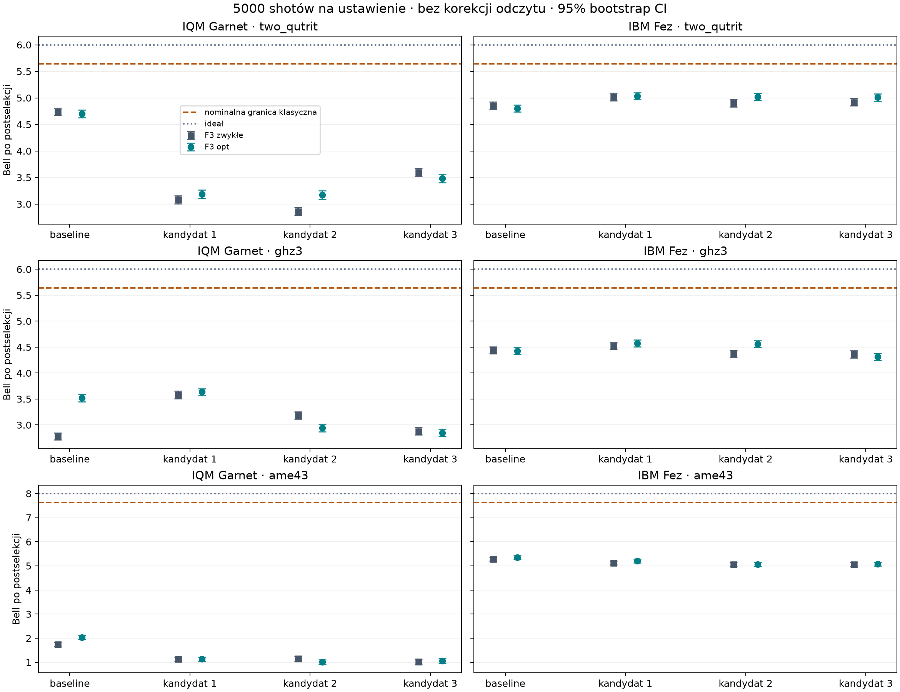

# Fez i IQM: pełne powtórzenie przy 5000 shotów

**Ukończono 48/48 wariantów:** 3 stany × (baseline + 3 kandydatów) × 2 wersje F3 × 2 rzeczywiste procesory. Każde z 544 ustawień Bella ma dokładnie 5000 shotów. Razem z kalibracjami wykonano 2 970 000 shotów. ZNE pominięte zgodnie z decyzją użytkownika.

**Poniższe główne wyniki są po postselekcji, bez korekcji odczytu.** ± oznacza 1 bootstrap SE. Większa liczba shotów poprawia precyzję, nie gwarantuje wyższej wartości Bella. Żaden wynik surowy nie przekroczył nominalnej granicy klasycznej.

## Najwyższe zmierzone wartości spośród wszystkich baz i obu F3

| Backend | Stan | Baza | F3 | Bell |
|---|---|---|---|---:|
| ibm | two_qutrit | sup023_P021_ph000 | optimal | 5.0309 ± 0.0351 |
| ibm | ghz3 | sup023_P021_ph001 | optimal | 4.5739 ± 0.0337 |
| ibm | ame43 | canonical_ez | optimal | 5.3524 ± 0.0404 |
| iqm | two_qutrit | canonical_ez | standard | 4.7397 ± 0.0350 |
| iqm | ghz3 | sup023_P021_ph001 | optimal | 3.6363 ± 0.0350 |
| iqm | ame43 | canonical_ez | optimal | 2.0291 ± 0.0468 |

## Najlepszy z trzech kandydatów z F3 opt

Wybór maksimum jest eksploracyjny. Delta baseline porównuje opt z opt; delta F3 porównuje opt ze zwykłym F3 w tej samej bazie. Pełne różnice dla wszystkich kandydatów i czterech estymatorów są w [differences.csv](differences.csv).

| Backend | Stan | Kandydat | Bell opt | Δ wobec baseline opt | Δ F3 opt − standard |
|---|---|---|---:|---:|---:|
| ibm | two_qutrit | sup023_P021_ph000 | 5.0309 ± 0.0351 | 0.2293 ± 0.0498 (+4.78%) | 0.0121 ± 0.0506 (+0.24%) |
| ibm | ghz3 | sup023_P021_ph001 | 4.5739 ± 0.0337 | 0.1502 ± 0.0478 (+3.40%) | 0.0549 ± 0.0473 (+1.21%) |
| ibm | ame43 | sup012_P210_ph002 | 5.2038 ± 0.0419 | -0.1485 ± 0.0578 (-2.78%) | 0.0786 ± 0.0588 (+1.53%) |
| iqm | two_qutrit | sup023_P021_ph020 | 3.4819 ± 0.0386 | -1.2187 ± 0.0527 (-25.93%) | -0.1151 ± 0.0550 (-3.20%) |
| iqm | ghz3 | sup023_P021_ph001 | 3.6363 ± 0.0350 | 0.1181 ± 0.0496 (+3.36%) | 0.0568 ± 0.0499 (+1.59%) |
| iqm | ame43 | sup012_P210_ph002 | 1.1295 ± 0.0476 | -0.8996 ± 0.0666 (-44.33%) | 0.0004 ± 0.0657 (+0.03%) |

## Porównanie ze wcześniejszą serią

[historical_comparison.csv](historical_comparison.csv) zawiera 192 porównania tego samego backendu, stanu, bazy, F3 i estymatora: nowe − poprzednie, SE, 95% CI, zmianę procentową i zmianę niepewności. Stare counts nie są łączone z nowymi.

| Backend | Mediana spadku SE (Bell po postselekcji) | Mediana zmiany Bella nowe − stare |
|---|---:|---:|
| ibm | 56.15% | +0.3363 |
| iqm | 64.16% | -1.3608 |

Fez osiągnął wyższe wyniki, lecz zmieniono także rep_delay z 250 do 75 µs i twirling z 16 do 8 randomizacji (8 × 625). Reset i DD XY4 pozostają włączone. Nie można przypisać zmiany wartości Bella samej liczbie shotów. IQM wykazuje spadek części wyników, szczególnie AME. Kontrole instrukcji, mapowania i kalibracji nie ustaliły przyczyny. Wyniki nie zostały odrzucone ani zastąpione wcześniejszymi.

## Koszt nowej serii i całej kampanii

Nowa seria: IBM **127 s QPU**; IQM górne **526.660 s**, czyli **263.330 kredytu** według przelicznika użytkownika.

Łącznie z poprzednimi pomiarami: IBM **438/540 s**; IQM górne **745.598/1000 s**, czyli **372.799/500 kredytów**. IQM to ograniczenie z timeline, nie faktura.

## Metody i dowody

Szczegóły, kandydaci, ograniczenia interpretacji i diagnostyka: [METODY.md](METODY.md). Protokoły: [protocol.json](protocol.json); macierze baz: [coding_bases.json](coding_bases.json). Job ID i koszty: [hardware_jobs.csv](hardware_jobs.csv). Weryfikacja wszystkich counts i fingerprintów: [completion_audit.json](completion_audit.json). Wyniki z SE i 95% CI: [results.csv](results.csv); komplet danych liczbowych: [summary.json](summary.json).

## Wyniki sprzętowe

± to 1 bootstrap SE. Tabele CSV/JSON zawierają 95% przedziały. Bootstrap obejmuje statystykę pomiarów oraz resampling kalibracji odczytu, wspólny dla ramion z tego samego joba. Nie obejmuje dryfu, błędu modelu odczytu ani modelu ZNE. Porównania i wybór największego zmierzonego wyniku są eksploracyjne; przedziały nie mają korekty wielokrotnych porównań.

Bell po postselekcji oznacza odrzucenie shotów z co najmniej jednym wynikiem poza kodem. Bell bez postselekcji przypisuje takim shotom wkład zero zgodnie z repo. Wynik po postselekcji lub mitygacji nie jest bezlukowym dowodem nielokalności; kubity uczestników są na tym samym procesorze.

### two_qutrit

Ideał: 6; nominalna granica klasyczna: 5.6381557.

| Baza | Logiczne 0,1,2: indeksy fizyczne | Faza F3 opt / π |
|---|---|---:|
| canonical_ez | (0, 1, 2) | 1.833333 |
| sup023_P021_ph000 | (0, 3, 2) | 0.500000 |
| sup023_P021_ph012 | (0, 3, 2) | 0.500000 |
| sup023_P021_ph020 | (0, 3, 2) | 0.500000 |

**IQM**

| Baza | F3 | Bell po postselekcji | Bell bez postselekcji | Po korekcji odczytu i postselekcji | Poza kodem |
|---|---|---:|---:|---:|---:|
| canonical_ez | standard | 4.7397 ± 0.0350 | 4.4264 ± 0.0330 | 5.0872 ± 0.0401 | 6.64% |
| canonical_ez | optimal | 4.7006 ± 0.0358 | 4.4326 ± 0.0339 | 5.0455 ± 0.0404 | 5.73% |
| sup023_P021_ph000 | standard | 3.0836 ± 0.0394 | 2.5640 ± 0.0333 | 3.3671 ± 0.0445 | 16.83% |
| sup023_P021_ph000 | optimal | 3.1854 ± 0.0407 | 2.5230 ± 0.0329 | 3.5023 ± 0.0462 | 20.69% |
| sup023_P021_ph012 | standard | 2.8643 ± 0.0406 | 2.2747 ± 0.0326 | 3.1894 ± 0.0465 | 20.62% |
| sup023_P021_ph012 | optimal | 3.1755 ± 0.0408 | 2.5565 ± 0.0333 | 3.5190 ± 0.0466 | 19.42% |
| sup023_P021_ph020 | standard | 3.5969 ± 0.0396 | 2.9989 ± 0.0337 | 3.9285 ± 0.0451 | 16.62% |
| sup023_P021_ph020 | optimal | 3.4819 ± 0.0386 | 2.8079 ± 0.0317 | 3.8434 ± 0.0442 | 19.28% |

| Baza | Δ Bell: F3 opt − zwykłe (po postselekcji) | Δ opt − baseline opt (po postselekcji) |
|---|---:|---:|
| canonical_ez | -0.0391 ± 0.0499 | 0.0000 ± 0.0000 |
| sup023_P021_ph000 | 0.1018 ± 0.0562 | -1.5151 ± 0.0551 |
| sup023_P021_ph012 | 0.3113 ± 0.0590 | -1.5250 ± 0.0548 |
| sup023_P021_ph020 | -0.1151 ± 0.0550 | -1.2187 ± 0.0527 |

Najwyższy zmierzony wynik kandydata z F3 opt (po postselekcji, bez korekcji odczytu): **sup023_P021_ph020**, Bell **3.4819 ± 0.0386**. Różnica względem baseline z F3 opt: **-1.2187 ± 0.0527**.
Dla tej bazy zmiana F3 zwykłe → opt daje **-0.1151 ± 0.0550**. Dodatnia różnica oznacza poprawę; ujemna pogorszenie. Wybór maksimum jest eksploracyjny.

**IBM**

| Baza | F3 | Bell po postselekcji | Bell bez postselekcji | Po korekcji odczytu i postselekcji | Poza kodem |
|---|---|---:|---:|---:|---:|
| canonical_ez | standard | 4.8549 ± 0.0354 | 4.5132 ± 0.0333 | 4.9467 ± 0.0368 | 7.07% |
| canonical_ez | optimal | 4.8016 ± 0.0345 | 4.4686 ± 0.0328 | 4.8928 ± 0.0358 | 6.94% |
| sup023_P021_ph000 | standard | 5.0188 ± 0.0361 | 4.6759 ± 0.0341 | 5.1147 ± 0.0372 | 6.87% |
| sup023_P021_ph000 | optimal | 5.0309 ± 0.0351 | 4.6800 ± 0.0334 | 5.1263 ± 0.0366 | 7.00% |
| sup023_P021_ph012 | standard | 4.8996 ± 0.0354 | 4.5794 ± 0.0335 | 4.9922 ± 0.0366 | 6.54% |
| sup023_P021_ph012 | optimal | 5.0195 ± 0.0341 | 4.6927 ± 0.0325 | 5.1144 ± 0.0353 | 6.52% |
| sup023_P021_ph020 | standard | 4.9209 ± 0.0353 | 4.5896 ± 0.0335 | 5.0138 ± 0.0364 | 6.76% |
| sup023_P021_ph020 | optimal | 5.0113 ± 0.0353 | 4.6836 ± 0.0334 | 5.1060 ± 0.0365 | 6.55% |

| Baza | Δ Bell: F3 opt − zwykłe (po postselekcji) | Δ opt − baseline opt (po postselekcji) |
|---|---:|---:|
| canonical_ez | -0.0534 ± 0.0496 | 0.0000 ± 0.0000 |
| sup023_P021_ph000 | 0.0121 ± 0.0506 | 0.2293 ± 0.0498 |
| sup023_P021_ph012 | 0.1198 ± 0.0492 | 0.2179 ± 0.0486 |
| sup023_P021_ph020 | 0.0905 ± 0.0497 | 0.2098 ± 0.0489 |

Najwyższy zmierzony wynik kandydata z F3 opt (po postselekcji, bez korekcji odczytu): **sup023_P021_ph000**, Bell **5.0309 ± 0.0351**. Różnica względem baseline z F3 opt: **0.2293 ± 0.0498**.
Dla tej bazy zmiana F3 zwykłe → opt daje **0.0121 ± 0.0506**. Dodatnia różnica oznacza poprawę; ujemna pogorszenie. Wybór maksimum jest eksploracyjny.

### ghz3

Ideał: 6; nominalna granica klasyczna: 5.6381557.

| Baza | Logiczne 0,1,2: indeksy fizyczne | Faza F3 opt / π |
|---|---|---:|
| canonical_ez | (0, 1, 2) | 1.833333 |
| sup023_P021_ph001 | (0, 3, 2) | 0.500000 |
| sup023_P021_ph011 | (0, 3, 2) | 0.500000 |
| sup023_P021_ph021 | (0, 3, 2) | 0.500000 |

**IQM**

| Baza | F3 | Bell po postselekcji | Bell bez postselekcji | Po korekcji odczytu i postselekcji | Poza kodem |
|---|---|---:|---:|---:|---:|
| canonical_ez | standard | 2.7786 ± 0.0345 | 2.4021 ± 0.0302 | 3.0608 ± 0.0387 | 13.82% |
| canonical_ez | optimal | 3.5182 ± 0.0344 | 3.0969 ± 0.0309 | 3.8851 ± 0.0404 | 12.68% |
| sup023_P021_ph001 | standard | 3.5795 ± 0.0361 | 2.9489 ± 0.0301 | 4.0260 ± 0.0435 | 18.34% |
| sup023_P021_ph001 | optimal | 3.6363 ± 0.0350 | 3.0511 ± 0.0300 | 4.1133 ± 0.0420 | 16.72% |
| sup023_P021_ph011 | standard | 3.1844 ± 0.0355 | 2.6225 ± 0.0300 | 3.6213 ± 0.0434 | 17.42% |
| sup023_P021_ph011 | optimal | 2.9425 ± 0.0374 | 2.2560 ± 0.0293 | 3.4045 ± 0.0453 | 22.99% |
| sup023_P021_ph021 | standard | 2.8791 ± 0.0360 | 2.3367 ± 0.0294 | 3.2778 ± 0.0423 | 19.78% |
| sup023_P021_ph021 | optimal | 2.8492 ± 0.0362 | 2.3496 ± 0.0300 | 3.2543 ± 0.0432 | 18.69% |

| Baza | Δ Bell: F3 opt − zwykłe (po postselekcji) | Δ opt − baseline opt (po postselekcji) |
|---|---:|---:|
| canonical_ez | 0.7396 ± 0.0483 | 0.0000 ± 0.0000 |
| sup023_P021_ph001 | 0.0568 ± 0.0499 | 0.1181 ± 0.0496 |
| sup023_P021_ph011 | -0.2419 ± 0.0516 | -0.5757 ± 0.0513 |
| sup023_P021_ph021 | -0.0299 ± 0.0518 | -0.6690 ± 0.0495 |

Najwyższy zmierzony wynik kandydata z F3 opt (po postselekcji, bez korekcji odczytu): **sup023_P021_ph001**, Bell **3.6363 ± 0.0350**. Różnica względem baseline z F3 opt: **0.1181 ± 0.0496**.
Dla tej bazy zmiana F3 zwykłe → opt daje **0.0568 ± 0.0499**. Dodatnia różnica oznacza poprawę; ujemna pogorszenie. Wybór maksimum jest eksploracyjny.

**IBM**

| Baza | F3 | Bell po postselekcji | Bell bez postselekcji | Po korekcji odczytu i postselekcji | Poza kodem |
|---|---|---:|---:|---:|---:|
| canonical_ez | standard | 4.4370 ± 0.0340 | 3.9313 ± 0.0306 | 4.6334 ± 0.0364 | 11.48% |
| canonical_ez | optimal | 4.4237 ± 0.0339 | 3.9406 ± 0.0308 | 4.6196 ± 0.0366 | 11.18% |
| sup023_P021_ph001 | standard | 4.5190 ± 0.0336 | 3.9544 ± 0.0301 | 4.7212 ± 0.0369 | 12.51% |
| sup023_P021_ph001 | optimal | 4.5739 ± 0.0337 | 4.0411 ± 0.0306 | 4.7773 ± 0.0365 | 11.63% |
| sup023_P021_ph011 | standard | 4.3731 ± 0.0338 | 3.8348 ± 0.0304 | 4.5683 ± 0.0368 | 12.29% |
| sup023_P021_ph011 | optimal | 4.5595 ± 0.0327 | 4.0235 ± 0.0294 | 4.7623 ± 0.0360 | 11.78% |
| sup023_P021_ph021 | standard | 4.3651 ± 0.0346 | 3.8425 ± 0.0313 | 4.5600 ± 0.0373 | 11.99% |
| sup023_P021_ph021 | optimal | 4.3160 ± 0.0339 | 3.7591 ± 0.0302 | 4.5093 ± 0.0366 | 13.02% |

| Baza | Δ Bell: F3 opt − zwykłe (po postselekcji) | Δ opt − baseline opt (po postselekcji) |
|---|---:|---:|
| canonical_ez | -0.0133 ± 0.0481 | 0.0000 ± 0.0000 |
| sup023_P021_ph001 | 0.0549 ± 0.0473 | 0.1502 ± 0.0478 |
| sup023_P021_ph011 | 0.1864 ± 0.0468 | 0.1359 ± 0.0473 |
| sup023_P021_ph021 | -0.0491 ± 0.0483 | -0.1077 ± 0.0476 |

Najwyższy zmierzony wynik kandydata z F3 opt (po postselekcji, bez korekcji odczytu): **sup023_P021_ph001**, Bell **4.5739 ± 0.0337**. Różnica względem baseline z F3 opt: **0.1502 ± 0.0478**.
Dla tej bazy zmiana F3 zwykłe → opt daje **0.0549 ± 0.0473**. Dodatnia różnica oznacza poprawę; ujemna pogorszenie. Wybór maksimum jest eksploracyjny.

### ame43

Ideał: 8; nominalna granica klasyczna: 7.6381557.

| Baza | Logiczne 0,1,2: indeksy fizyczne | Faza F3 opt / π |
|---|---|---:|
| canonical_ez | (0, 1, 2) | 1.833333 |
| sup012_P210_ph002 | (2, 1, 0) | 0.500000 |
| sup023_P021_ph000 | (0, 3, 2) | 0.500000 |
| sup023_P021_ph011 | (0, 3, 2) | 0.500000 |

**IQM**

| Baza | F3 | Bell po postselekcji | Bell bez postselekcji | Po korekcji odczytu i postselekcji | Poza kodem |
|---|---|---:|---:|---:|---:|
| canonical_ez | standard | 1.7493 ± 0.0469 | 1.1986 ± 0.0324 | 1.9768 ± 0.0538 | 32.88% |
| canonical_ez | optimal | 2.0291 ± 0.0468 | 1.4282 ± 0.0331 | 2.2852 ± 0.0539 | 31.93% |
| sup012_P210_ph002 | standard | 1.1292 ± 0.0465 | 0.7137 ± 0.0297 | 1.3392 ± 0.0544 | 36.33% |
| sup012_P210_ph002 | optimal | 1.1295 ± 0.0476 | 0.7358 ± 0.0315 | 1.3308 ± 0.0554 | 33.79% |
| sup023_P021_ph000 | standard | 1.1473 ± 0.0521 | 0.6453 ± 0.0294 | 1.3543 ± 0.0613 | 44.61% |
| sup023_P021_ph000 | optimal | 1.0128 ± 0.0495 | 0.5762 ± 0.0280 | 1.1887 ± 0.0576 | 43.99% |
| sup023_P021_ph011 | standard | 1.0294 ± 0.0524 | 0.5581 ± 0.0286 | 1.2072 ± 0.0616 | 46.84% |
| sup023_P021_ph011 | optimal | 1.0594 ± 0.0532 | 0.5788 ± 0.0290 | 1.2468 ± 0.0627 | 45.99% |

| Baza | Δ Bell: F3 opt − zwykłe (po postselekcji) | Δ opt − baseline opt (po postselekcji) |
|---|---:|---:|
| canonical_ez | 0.2798 ± 0.0657 | 0.0000 ± 0.0000 |
| sup012_P210_ph002 | 0.0004 ± 0.0657 | -0.8996 ± 0.0666 |
| sup023_P021_ph000 | -0.1346 ± 0.0725 | -1.0164 ± 0.0679 |
| sup023_P021_ph011 | 0.0301 ± 0.0750 | -0.9697 ± 0.0705 |

Najwyższy zmierzony wynik kandydata z F3 opt (po postselekcji, bez korekcji odczytu): **sup012_P210_ph002**, Bell **1.1295 ± 0.0476**. Różnica względem baseline z F3 opt: **-0.8996 ± 0.0666**.
Dla tej bazy zmiana F3 zwykłe → opt daje **0.0004 ± 0.0657**. Dodatnia różnica oznacza poprawę; ujemna pogorszenie. Wybór maksimum jest eksploracyjny.

**IBM**

| Baza | F3 | Bell po postselekcji | Bell bez postselekcji | Po korekcji odczytu i postselekcji | Poza kodem |
|---|---|---:|---:|---:|---:|
| canonical_ez | standard | 5.2815 ± 0.0413 | 4.1891 ± 0.0347 | 5.5396 ± 0.0449 | 20.53% |
| canonical_ez | optimal | 5.3524 ± 0.0404 | 4.2939 ± 0.0341 | 5.6127 ± 0.0439 | 19.89% |
| sup012_P210_ph002 | standard | 5.1252 ± 0.0413 | 3.9286 ± 0.0335 | 5.3773 ± 0.0451 | 23.05% |
| sup012_P210_ph002 | optimal | 5.2038 ± 0.0419 | 4.0292 ± 0.0340 | 5.4599 ± 0.0457 | 22.31% |
| sup023_P021_ph000 | standard | 5.0616 ± 0.0420 | 3.9085 ± 0.0341 | 5.3106 ± 0.0458 | 22.76% |
| sup023_P021_ph000 | optimal | 5.0700 ± 0.0421 | 3.8975 ± 0.0338 | 5.3202 ± 0.0459 | 22.87% |
| sup023_P021_ph011 | standard | 5.0602 ± 0.0418 | 3.9118 ± 0.0339 | 5.3097 ± 0.0456 | 23.07% |
| sup023_P021_ph011 | optimal | 5.0809 ± 0.0402 | 3.9310 ± 0.0326 | 5.3312 ± 0.0440 | 22.69% |

| Baza | Δ Bell: F3 opt − zwykłe (po postselekcji) | Δ opt − baseline opt (po postselekcji) |
|---|---:|---:|
| canonical_ez | 0.0709 ± 0.0571 | 0.0000 ± 0.0000 |
| sup012_P210_ph002 | 0.0786 ± 0.0588 | -0.1485 ± 0.0578 |
| sup023_P021_ph000 | 0.0084 ± 0.0596 | -0.2824 ± 0.0586 |
| sup023_P021_ph011 | 0.0207 ± 0.0584 | -0.2715 ± 0.0574 |

Najwyższy zmierzony wynik kandydata z F3 opt (po postselekcji, bez korekcji odczytu): **sup012_P210_ph002**, Bell **5.2038 ± 0.0419**. Różnica względem baseline z F3 opt: **-0.1485 ± 0.0578**.
Dla tej bazy zmiana F3 zwykłe → opt daje **0.0786 ± 0.0588**. Dodatnia różnica oznacza poprawę; ujemna pogorszenie. Wybór maksimum jest eksploracyjny.

## Koszt końcowych obwodów

Liczby CZ dotyczą całego zestawu ustawień Bella (9/12/13 obwodów), przed dodaniem DD/twirlingu przez IBM i przed ewentualnym foldingiem ZNE.

| Dostawca | Stan | Baza | CZ zwykłe F3 | CZ opt F3 | Redukcja |
|---|---|---|---:|---:|---:|
| iqm | two_qutrit | canonical_ez | 207 | 189 | 18 |
| iqm | two_qutrit | sup023_P021_ph000 | 219 | 210 | 9 |
| iqm | two_qutrit | sup023_P021_ph012 | 219 | 210 | 9 |
| iqm | two_qutrit | sup023_P021_ph020 | 219 | 210 | 9 |
| iqm | ghz3 | canonical_ez | 537 | 483 | 54 |
| iqm | ghz3 | sup023_P021_ph001 | 546 | 522 | 24 |
| iqm | ghz3 | sup023_P021_ph011 | 546 | 522 | 24 |
| iqm | ghz3 | sup023_P021_ph021 | 546 | 522 | 24 |
| iqm | ame43 | canonical_ez | 1020 | 968 | 52 |
| iqm | ame43 | sup012_P210_ph002 | 980 | 954 | 26 |
| iqm | ame43 | sup023_P021_ph000 | 980 | 954 | 26 |
| iqm | ame43 | sup023_P021_ph011 | 980 | 954 | 26 |
| ibm | two_qutrit | canonical_ez | 252 | 234 | 18 |
| ibm | two_qutrit | sup023_P021_ph000 | 219 | 210 | 9 |
| ibm | two_qutrit | sup023_P021_ph012 | 219 | 210 | 9 |
| ibm | two_qutrit | sup023_P021_ph020 | 219 | 210 | 9 |
| ibm | ghz3 | canonical_ez | 567 | 531 | 36 |
| ibm | ghz3 | sup023_P021_ph001 | 534 | 510 | 24 |
| ibm | ghz3 | sup023_P021_ph011 | 534 | 510 | 24 |
| ibm | ghz3 | sup023_P021_ph021 | 534 | 510 | 24 |
| ibm | ame43 | canonical_ez | 1191 | 1139 | 52 |
| ibm | ame43 | sup012_P210_ph002 | 1158 | 1132 | 26 |
| ibm | ame43 | sup023_P021_ph000 | 1158 | 1132 | 26 |
| ibm | ame43 | sup023_P021_ph011 | 1158 | 1132 | 26 |

## Budżet i dowody wykonania

| Dostawca | Job | Status | Czas [s] | Rodzaj |
|---|---|---|---:|---|
| iqm | 01a07b56-990b-7b23-90ba-eb40e745537b | completed | 18.776 | górne ograniczenie QPU z timeline |
| iqm | 01a07b56-f9bb-7b63-a48d-04b573ea50d8 | completed | 17.581 | górne ograniczenie QPU z timeline |
| iqm | 01a07b57-5aa7-7be0-ad6a-e5d49c842570 | completed | 19.069 | górne ograniczenie QPU z timeline |
| iqm | 01a07b57-b9a5-7622-b0d4-dd0db92c4c6f | completed | 17.534 | górne ograniczenie QPU z timeline |
| iqm | 01a07b58-18d4-7182-b4cf-0e31ef50c643 | completed | 17.708 | górne ograniczenie QPU z timeline |
| iqm | 01a07b58-77ec-7850-a546-449ae2075965 | completed | 19.313 | górne ograniczenie QPU z timeline |
| iqm | 01a07b58-d819-72c0-84a9-e787568dc34e | completed | 17.578 | górne ograniczenie QPU z timeline |
| iqm | 01a07b59-36df-7e11-9032-99df01fc0797 | completed | 18.440 | górne ograniczenie QPU z timeline |
| iqm | 01a07b59-97fd-7650-936a-adecce9017e3 | completed | 22.482 | górne ograniczenie QPU z timeline |
| iqm | 01a07b5a-0f63-7493-9209-368614950f1d | completed | 23.122 | górne ograniczenie QPU z timeline |
| iqm | 01a07b5a-8a26-7b10-ad61-4fcf92039eee | completed | 22.285 | górne ograniczenie QPU z timeline |
| iqm | 01a07b5b-02a8-7c42-903d-9f860f935c3e | completed | 22.358 | górne ograniczenie QPU z timeline |
| iqm | 01a07b5b-7b20-7902-88a1-9a119fb65ca5 | completed | 22.352 | górne ograniczenie QPU z timeline |
| iqm | 01a07b5b-f4be-73f1-8018-41133ebd2cdb | completed | 22.613 | górne ograniczenie QPU z timeline |
| iqm | 01a07b5c-6f7f-7d02-b67b-718431611fc6 | completed | 23.804 | górne ograniczenie QPU z timeline |
| iqm | 01a07b5c-e771-7d72-9049-b8d7d4d508bb | completed | 24.526 | górne ograniczenie QPU z timeline |
| iqm | 01a07b5d-69c2-7b10-8f82-9916156470e8 | completed | 24.418 | górne ograniczenie QPU z timeline |
| iqm | 01a07b5d-e4fc-7a03-8740-b7be16e0762f | completed | 25.481 | górne ograniczenie QPU z timeline |
| iqm | 01a07b5e-5fd8-7190-8c89-fbd9b1a7eaf2 | completed | 24.280 | górne ograniczenie QPU z timeline |
| iqm | 01a07b5e-da8b-7822-b752-15d34d3c43fa | completed | 24.575 | górne ograniczenie QPU z timeline |
| iqm | 01a07b5f-564b-7ed2-9a96-9ee8f7e435ed | completed | 24.389 | górne ograniczenie QPU z timeline |
| iqm | 01a07b5f-d3d0-71c1-b52c-2a402745cbf7 | completed | 24.324 | górne ograniczenie QPU z timeline |
| iqm | 01a07b60-4fb3-7300-b502-0db62879f2d2 | completed | 24.159 | górne ograniczenie QPU z timeline |
| iqm | 01a07b60-ce42-7c10-b89f-956c8e8503a1 | completed | 25.494 | górne ograniczenie QPU z timeline |
| ibm | daf8ptm42tqs73avkj50 | completed | 127.000 | rozliczony |

Limit tej kampanii: 540 s IBM, 1000 s IQM (500 kredytów, stawka podana przez użytkownika: 1 kredyt / 2 s). Wpis bez potwierdzonego zużycia zachowuje pełną rezerwę. Czas oczekiwania w kolejce nie jest czasem QPU.

IBM ma twardy limit czasu każdego zadania. IQM nie udostępnia analogicznego limitu: dalsze rezerwacje wyznacza zmierzony koszt pilota lub górne ograniczenie z timeline, sumy kalibrowanych czasów bramek, mnożnik bezpieczeństwa 2 oraz 30 s zapasu. Górne ograniczenie IQM obejmuje cały przedział od przyjęcia przez station control do ukończenia przez server, włącznie z kompilacją i przetwarzaniem wyników; nie jest fakturą. Batch IQM ma rezerwę najwyżej 240 s. Osobny proces nadzoruje czas przetwarzania i zleca anulowanie 30 s przed końcem rezerwy. To kontrola klienta, nie gwarancja dostawcy; zależy od łączności i czasu anulowania.

Dokumentacja dostawców: [IBM: limit czasu](https://quantum.cloud.ibm.com/docs/en/guides/max-execution-time), [IBM: zużycie](https://quantum.cloud.ibm.com/docs/en/guides/estimate-job-run-time), [IQM Resonance](https://iqm.tech/products/iqm-resonance/).
